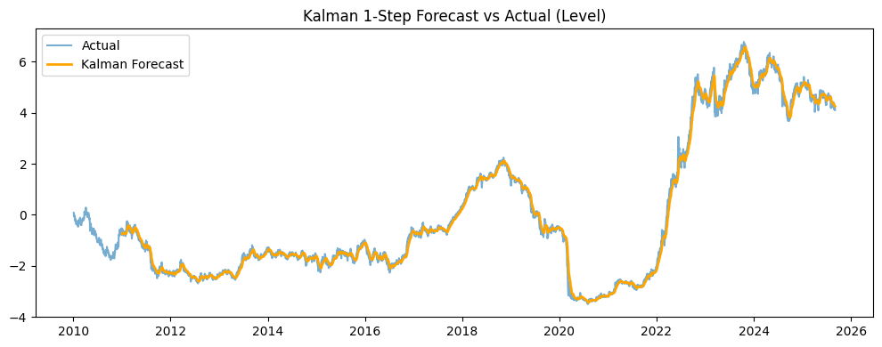
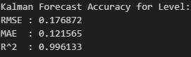
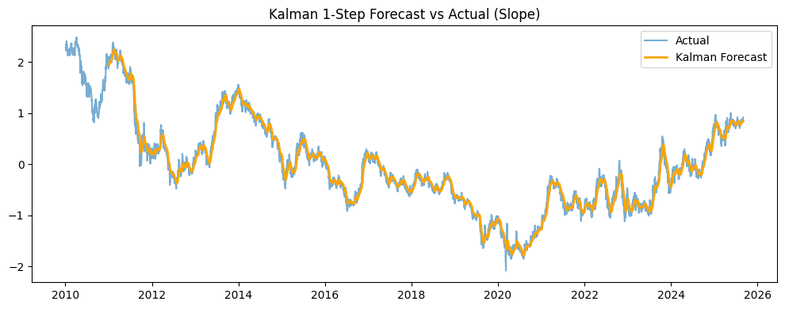
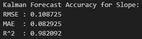
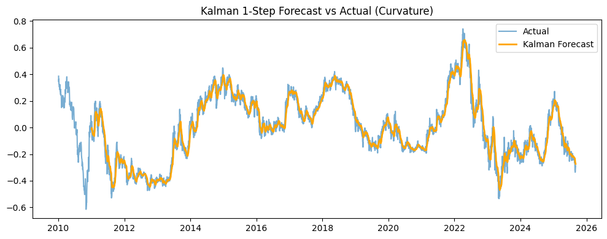
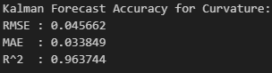
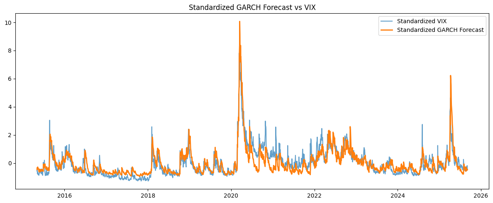
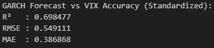
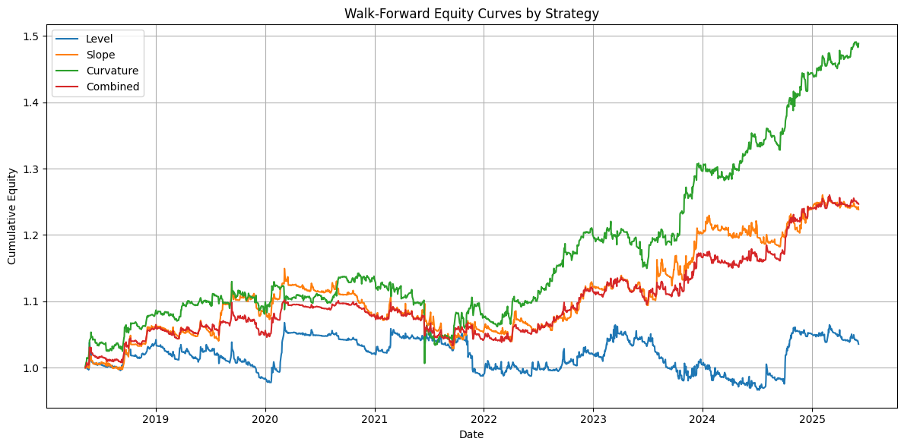
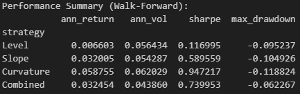

# Treasury Factor Strategy

This project models the U.S. Treasury yield curve, forecasts its dynamics, and implements a simple systematic trading strategy in Treasury futures. It combines PCA factor modeling, Kalman filtering, and GARCH volatility forecasting with a backtesting framework.

---

## Overview

- **Data**

  - U.S. Treasury yields (1Y, 2Y, 5Y, 10Y, 30Y) from FRED
  - SPY and VIX from Yahoo Finance
  - Treasury futures (2Y, 5Y, 10Y, 30Y) from Yahoo Finance

- **Modeling Steps**

  1. **Yield Curve Factors (PCA):** Extract Level, Slope, and Curvature from daily yield data.
  2. **Forecasting with Kalman Filter:** Generate one-step-ahead forecasts for each factor.
  3. **Volatility Forecasting with GARCH:** Apply a GARCH(1,1) model to SPY returns to estimate forward volatility, compared with realized volatility and VIX.

- **Trading Strategy**

  - Signals are based on the **deviation between Kalman forecasted factors and actual realized factors**:
  - Signals are z-scored over a rolling window and clipped to avoid extreme exposures.
  - Mapped into futures positions:
    - Level → 10Y futures
    - Slope → Long 10Y vs Short 2Y
    - Curvature → 2×5Y – 2Y – 30Y structure
  - Exposures are scaled to a **target volatility** using GARCH forecasts, with a leverage cap.

- **Backtesting**
  - In-sample vs out-of-sample split
  - Walk-forward analysis with rolling windows
  - Performance metrics: annualized return, volatility, Sharpe ratio, maximum drawdown

---

## Key Components

- **PCA:** Dimension reduction of the yield curve into three factors (Level, Slope, Curvature).
- **Kalman Filter:** One-step prediction and smoothing of factors.
- **GARCH:** Daily volatility forecasts from SPY returns, used for risk targeting.
- **Backtester:** Portfolio construction, signal scaling, and walk-forward validation.

---

## Results

### Factor Forecasts

- **Level Forecast vs Actual**

  

  

- **Slope Forecast vs Actual**

  

  

- **Curvature Forecast vs Actual**

  

  

---

### Volatility Forecasts

- **GARCH Forecast of SPY's volatility vs VIX**

  

  

---

### Strategy Backtests

- **Equity Curves**

  

- **Performance Summary**

  

---

## Tech Stack

- **Python:** `numpy`, `pandas`, `matplotlib`, `scikit-learn`, `arch`, `filterpy`, `yfinance`, `fredapi`
- **Methods:** PCA, Kalman Filter, GARCH, z-score signals, volatility targeting, walk-forward testing

---
